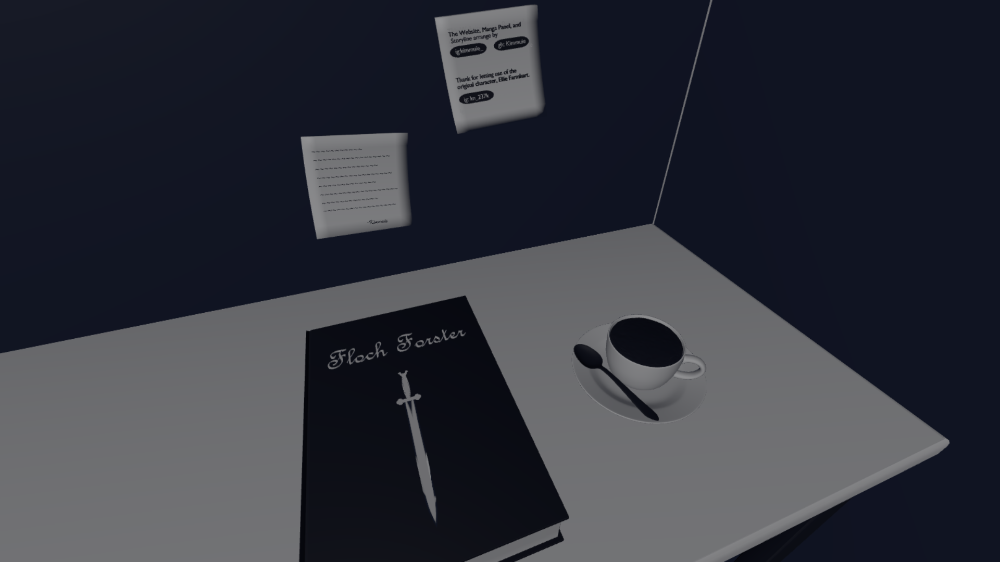
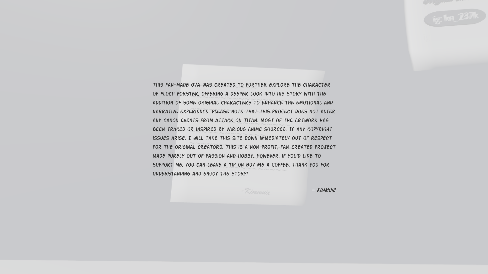
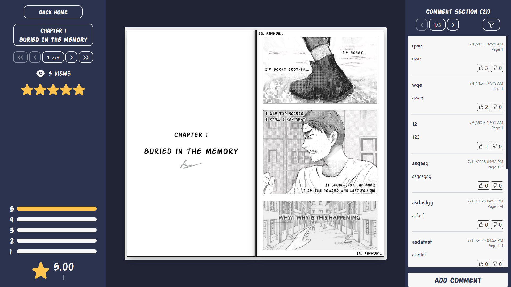
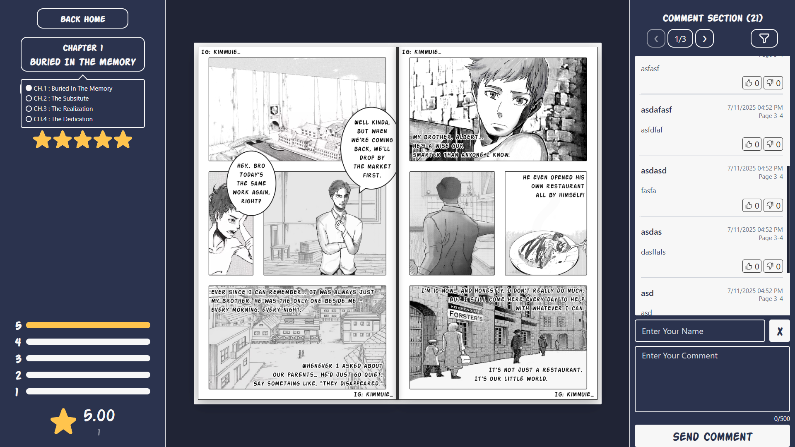

# FlochForsterOVA

### What is [FlochForsterOVA](https://flochova-ca6b7.web.app/)?
**FlochForsterOVA** is a fan-made web platform dedicated to exploring the story of Floch Forster from Attack on Titan. It provides a space to experience a non-canon OVA that expands on his character, introducing original storylines and additional characters to deepen the narrative and emotional impact.

**Key features include:**
📖 OVA Chapters & Episodes – Read fan-created stories expanding Floch’s journey.  
🎭 Original Characters – Discover new personalities woven into the narrative.  
🎨 Art & Visuals – Featuring artwork traced or inspired by anime sources.  
📂 Organized Story Archive – Easy navigation through episodes and updates.  

⚠️ Disclaimer: This is a non-profit, fan-created project made purely out of passion and hobby. It does not change or replace any canon events from Attack on Titan. If any copyright issues arise, this site will be taken down immediately out of respect for the original creators.

💡 If you’d like to support the project, you can leave a tip on [Buy Me a Coffee](https://coff.ee/kimmue).
Thank you for understanding, and enjoy the story!
----------- Click here to read [FlochForsterOVA](https://flochova-ca6b7.web.app/) ----------- 
 
 
 

### Used Language/Tools

  

   

### Website Interface

  
  
  
  

## License
This project is licensed under the MIT License — see the [LICENSE](LICENSE) file for details.
